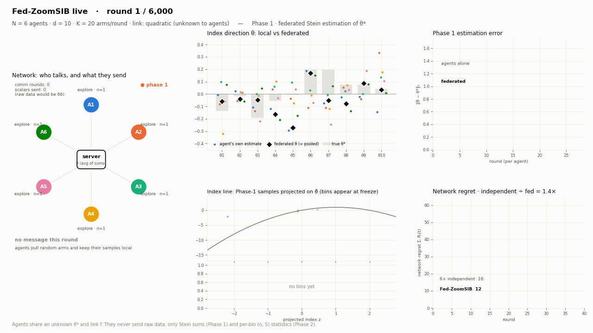
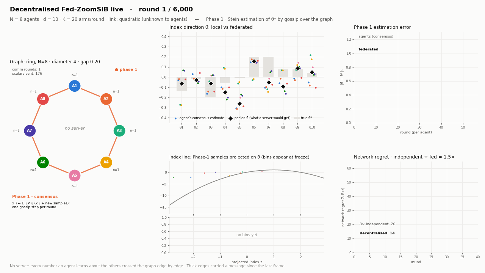

# Fed-ZoomSIB — Federated Single-Index Bandits

**CS6007: Multi-Agent Machine Learning · IIT Bombay · Prof. Avishek Ghosh**

Cooperative contextual bandits in which **neither the index direction `θ*` nor the reward
link function `f` is known**, and agents must learn both while sharing very little.

```
y_{i,t} = f( <x_{i,t}, θ*> ) + η_{i,t}        f unknown, non-monotone, θ* unknown
```

---

## TL;DR

1. **We reproduced the single-agent state of the art** (ZoomSIB-UCB, Dey, Bhore & Ghosh 2026)
   against five baselines (E1–E5).
2. **We built Fed-ZoomSIB**, a federated version for N agents, and measured what collaboration
   buys: network regret grows like **N^0.48** instead of N^1.04 for independent agents, so
   at N = 8 regret drops from 17 270 to 5 155 (E6–E9). A live GIF shows the agents working.
3. **We benchmarked 14 federated-learning methods** (FedAvg, FedSGD, FedProx, FedAvgM, FedAdam,
   FedYogi, FedNova, SCAFFOLD, FedDyn, split learning, distillation, gradient-based FL,
   personalised FL, plus exact sufficient statistics) as the aggregator of each phase,
   under four kinds of agent heterogeneity (E10–E13).
4. **We built a serverless version** in which agents talk only over a graph with a
   communication matrix: 13 topologies, 5 mixing matrices, link failures, randomised gossip,
   directed links, 11 Phase-1 and 13 Phase-2 strategies (E14–E21). *Spanning-tree pooling +
   event-triggered flooding* comes within **3 %** of the server version **with the same
   communication**, and keeps the N^0.44–0.46 scaling on well-connected graphs.
5. **The version to prove** is *sufficient-statistic Fed-ZoomSIB with event-triggered
   sync and a fixed Phase-1 length*: it ranks first in both benchmarks, needs **134× less
   communication** than per-round sync for the same regret, and is the only variant whose
   estimators are *exactly* the centralised ones. That exactness is what makes a clean
   proof possible. The decentralised twin above is the natural second theorem.
   See [Which version to prove](#which-version-to-prove).

---

## What this project is

**Single-index bandits** (Kang et al., ICLR 2026) drop the standard assumption that the
link function is known — an assumption whose violation causes *linear* regret, not graceful
degradation. **ZoomSIB-UCB** (Dey, Bhore & Ghosh, 2026) settles the single-agent question
with a matching `Θ̃(T^{2/3})` upper and lower bound for general non-monotone links.

Nobody has studied the **multi-agent** version. That gap is this project:

> What does collaboration buy in a single-index bandit, and at what communication cost?

ZoomSIB-UCB has two phases, and both can be federated:

- **Phase 1** estimates `θ*` with a truncated **Stein estimator**, which is a *sample mean*,
  so averaging across agents can reproduce the centralised estimator exactly.
- **Phase 2** runs a *sleeping* UCB over `O(T^{1/3})` bins of the projected index line,
  whose entire state is two scalars per bin, `(n_j, S_j)`.

---

## Status

| Stage | Content | State |
|---|---|---|
| 0 | Project pitch (5 min) | deck builds; **needs names + roll numbers** |
| 1 | Single-agent baseline and reproduction (E1–E5) | **complete** |
| 2 | Fed-ZoomSIB: federated Phase 1 + cooperative Phase 2, communication study (E6–E9) | **complete** |
| 3 | FL-method benchmark across both phases and four heterogeneity scenarios (E10–E13) | **complete** |
| 3b | Decentralised version over a communication graph, no server (E14–E21) | **complete** |
| 4 | Regret analysis of the chosen version | **next** — plan [below](#proof-plan) |
| 5 | One extension (heterogeneous θ* / safety / Byzantine agents) | not started |

---

## All experiments at a glance

| | Script | Question | Headline answer | Output |
|---|---|---|---|---|
| E1 | `exp01_stein_rate.py` | Does the Stein estimator converge at `n^{-1/2}`? | yes: fitted −0.496…−0.501 for d ∈ {5,…,40} | `fig01` |
| E2 | `exp02_regret_curves.py` | ZoomSIB-UCB vs baselines, four links | ZoomSIB best on all three non-monotone links | `fig02` |
| E3 | `exp03_loglog_slope.py` | Regret exponent in T | 0.294 (quadratic) … 0.602 (flattest link) ≤ 2/3 | `fig03` |
| E4 | `exp04_dim_scaling.py` | Regret vs dimension d | single-index methods degrade gracefully; IGP-UCB does not | `fig04` |
| E5 | `exp05_explore_tradeoff.py` | How long should Phase 1 be? | optimum ≈ 2 % of horizon; adaptive stop picks 1.67 % | `fig05` |
| E6 | `exp06_fed_scaling.py` | Network regret vs number of agents N | exponent in N: **1.04** independent → **0.77** Phase-1 sharing → **0.48** both phases | `fig06`, `fig07` |
| E7 | `exp07_phase1_strategies.py` | How to pool θ (exact / FedAvg-of-estimates / median / quantised) | exact = centralised; 8-bit quantisation free; 2-bit breaks the stopping rule | `fig08` |
| E8 | `exp08_phase2_strategies.py` | Regret vs communication for Phase-2 sharing schedules | event-triggered sync matches per-round sync with **53× less** communication | `fig09` |
| E9 | `exp09_fed_live.py` | Watch it run | live GIF of agents, messages, θ estimates, bin table, regret | `fed_live_*.gif` |
| E10 | `exp10_fl_phase1.py` | Which **FL method** should pool θ? | on the Stein objective every exact-in-one-round method gives the *same* θ̂; the rest only add communication or error | `fig10`, [table](results/fl_phase1_benchmark.md) |
| E11 | `exp11_fl_phase2.py` | Which **FL method** should share the bin table? | only sufficient statistics are exact; model averaging is biased (5–20× the staleness error), iterative methods cost 8–16× more | `fig11`, [table](results/fl_phase2_benchmark.md) |
| E12 | `exp12_fl_benchmark.py` | Phase-1 method × Phase-2 method, all scenarios | **winner: sufficient statistics + event-triggered sync** | `fig12`, [table](results/fl_benchmark.md) |
| E13 | `exp13_bin_width.py` | Bin width for N agents: `T^{-1/3}` or `(NT)^{-1/3}`? | the theory-optimal `(NT)^{-1/3}` is 7–13 % worse on benign links | `fig13` |
| E14 | `exp14_dec_phase1.py` | Pooling θ over a graph: which strategy, which stopping rule? | tree and Chebyshev gossip match the server; the `any` stop rule doubles regret, a fixed T₀ beats adaptive stopping | `fig14`, [table](results/dec_phase1_benchmark.md) |
| E15 | `exp15_dec_phase2.py` | Sharing the bin table over a graph | event-triggered flooding: +2–5 % regret at the server's communication; consensus costs 2 000× more | `fig15`, [table](results/dec_phase2_benchmark.md) |
| E16 | `exp16_dec_topology.py` | 12 topologies × 5 designs | at a fixed T₀, flooding's cost grows with the diameter (+1 % at D = 1 → +15 % at D = 15), consensus's with the spectral gap | `fig16`, [table](results/dec_topology_fair.md) |
| E17 | `exp17_dec_mixing.py` | Which communication matrix? | best-constant Laplacian is best; row-stochastic weights are biased on irregular graphs (+33 % on a star) | `fig17`, [table](results/dec_mixing_fair.md) |
| E18 | `exp18_dec_dynamic.py` | Link failures, randomised gossip, directed links | flooding most robust (+27 % at 90 % failures); Chebyshev collapses (2–7×) | `fig18`, [table](results/dec_dynamic_benchmark.md) |
| E19 | `exp19_dec_scaling.py` | Network regret vs N without a server | exponent 0.44 (complete), 0.46 (hypercube), 0.55 (ring) vs 0.43 server, 0.98 independent | `fig19`, [table](results/dec_scaling_benchmark.md) |
| E20 | `exp20_dec_benchmark.py` | Phase-1 × Phase-2 decentralised leaderboard at fixed T₀ | **winner: spanning tree + event-triggered flooding**, ×1.03 of the server at the same communication | `fig20`, [table](results/dec_benchmark.md) |
| E21 | `exp21_dec_live.py` | Watch it run on a graph | live GIFs: ring, directed graph, failing hypercube | `dec_live_*.gif` |

Common setup unless stated: `d = 10`, `K = 20` arms per round, noise σ = 0.1, contexts scaled
to unit index variance, `T = 10 000` rounds per agent, N = 8 agents, 8 paired trials (every
configuration sees the same contexts and noise).

---

## Single-agent reproduction (E1–E5)

Final regret at `T = 20 000`, `d = 10`, `K = 20`, 20 trials (lower is better):

| | quadratic | asymmetric | zigzag | logistic *(monotone)* |
|---|---:|---:|---:|---:|
| **ZoomSIB-UCB** | **2657** | **1371** | **1358** | 906 |
| GSTOR | 10593 | 2325 | 7701 | 1910 |
| ESTOR | 21267 | 6304 | 2918 | 708 |
| IGP-UCB | 8510 | 7274 | 6642 | 5175 |
| LinUCB | 17865 | 5190 | 1063 | **127** |

- The Stein estimator converges at **exactly `n^{-1/2}`**.
- Adaptive stopping exits Phase 1 at **1.67 %** of the horizon on the quadratic link,
  matching the ~1.8 % Dey et al. report; the measured optimum is ~2 %.
- ZoomSIB-UCB's fitted regret exponent is **0.294** on quadratic — close to the `T^{1/3}`
  that Corollary 4.8 predicts for a link with a unique well-separated maximum — and 0.602
  on the flattest link, approaching the `2/3` worst case.
- ESTOR, which assumes monotonicity, is *worse than LinUCB* on the quadratic link and best
  on the monotone one — the assumption made visible.

---

## Fed-ZoomSIB (E6–E9)

N agents share the unknown `θ*` and `f`; each sees its own contexts. The engine
([src/fed/engine.py](src/fed/engine.py)) keeps ZoomSIB-UCB's two phases:

1. **Phase 1**: every agent pulls uniformly at random and keeps its samples local. At
   geometric checkpoints the network pools a θ estimate; ZoomSIB's adaptive stopping rule
   runs on the *pooled* sample size, so per-agent exploration shrinks with N.
2. **Freeze**: `θ̂₀` is frozen for **every agent at once** (keeping Remark 3.1's sample
   splitting valid network-wide) and one shared bin grid is broadcast.
3. **Phase 2**: each agent runs sleeping UCB over the bins available to it, acting on a
   shared bin table plus its own not-yet-synced pulls.

How θ is pooled and how the table is shared are pluggable strategies; see
[Repository layout](#repository-layout).

### Results

- **Exact pooling is exact**: `‖θ̂_fed − θ̂_pooled‖∞ = 2.2e-16`.
- **Per-agent Phase 1 shrinks ~1/N**: on quadratic, `T₀` goes 349 → 147 → 86 → 52 → 32 for
  N = 1 → 16, while independent agents stay at ~280 each.
- **Network regret scales like √N**: fitted exponent of `R_T(N)` in N on quadratic is
  **1.04** for independent agents, **0.77** with Phase-1 sharing only, and **0.48** for
  full Fed-ZoomSIB (zigzag 1.00 / 0.76 / 0.56; logistic 0.96 / 0.61 / 0.37).
- **One Phase-1 message is worth a lot**: Phase-1 sharing alone uses ~600 scalars *in total*
  and removes ~44 % of network regret at N = 8 (quadratic).
- **Event-triggered sync dominates periodic sync**: γ = 0.5 reaches 5 187 regret
  (every-round sync: 5 155) with 30k scalars instead of 1.57M.
- **The stopping rule is the weak point**: strategies whose estimates are *noisier*
  (median, FedAdam) sometimes get lower regret, only because the drift-based rule then
  explores longer. Its tolerance was tuned for one agent; with N agents it stops too early.

### Watching it run

```bash
python experiments/exp09_fed_live.py                          # results/fed_live_p2_periodic_25_quadratic.gif
python experiments/exp09_fed_live.py --config p2_event_1 --link zigzag
python experiments/exp09_fed_live.py --live                   # also plays in a window
```



Panels: the network (arrows light up with what each message carries; badges count an
agent's unsynced pulls) · every agent's own `θ̂` vs the federated one vs `θ*` · Phase-1
error, local vs federated · the shared bin table on the index line, with stacked bars of
whose pulls fed each bin (hatched = not yet synced) · network regret vs N independent agents
on the same contexts.

---

## FL-method benchmark (E10–E13)

### The key observation: both phases are federated least squares

Each agent `i` holds a local loss `F_i(w) = (½ wᵀH_i w − b_iᵀ w) / n_i`, and the
centralised estimator is the pooled optimum `w* = (Σ H_i)⁻¹ Σ b_i`:

| Phase | `H_i` | `b_i` | Heterogeneity across agents |
|---|---|---|---|
| 1, Stein (what ZoomSIB uses) | `n_i · I` | `Σ φτ(y·S(x))` | **none**: identical per-sample Hessians |
| 1, LS (Stein with estimated covariance) | `X_iᵀX_i` | `X_iᵀ y` | moderate |
| 2, bin table | `diag(n_ij)` | `(S_ij)_j` | **severe**: agents visit bins at very different rates |

So every FL method is an algorithm for the same problem, implemented once
([src/fed/fl/](src/fed/fl/)), and its distance from the centralised answer can be measured
directly. Client drift, the problem most FL methods exist to fix, comes from *heterogeneous
Hessians*. Phase 1 has none; Phase 2 has a lot.

### How each FL method maps onto Fed-ZoomSIB

| FL method | Client sends | Server does | Verdict in Phase 1 | Verdict in Phase 2 |
|---|---|---|---|---|
| **Sufficient statistics** (exact) | `(H_i, b_i)`: `d+1` numbers / `(bin, n, S)` per touched bin | `(ΣH)⁻¹Σb` | **exact, cheapest** | **exact, cheapest** |
| Split learning | per-sample activations `φτ(yS(x))` / `(bin, y)` | finishes the mean | exact, 4.6× the scalars | exact, pays per pull |
| FedAvg (one-shot) | local optimum | weighted average | exact (identical Hessians) | **biased** (+5.5 % regret, covariate shift) |
| FedAvg (E local steps) | local model | weighted average | exact with E = 1 (tuning always picked E = 1) | biased; 8× the communication |
| FedSGD / gradient-based FL | gradient | averaged GD step | exact in 1 round (η = 1) | converges slowly; rare bins lag |
| FedProx | prox-regularised local model | weighted average | slower than FedAvg, same answer | biased, slow |
| FedAvgM | model update | server momentum | overshoots after an exact round | slow |
| FedAdam / FedYogi | model update | server Adam / Yogi | never exact (30 % error after 10 rounds) | slow |
| FedNova | normalised update + τ_i | normalised aggregation | biased under unequal participation | slow |
| SCAFFOLD | update + control variate (2×) | drift correction | exact (nothing to correct) | converges to exact; 16× communication |
| FedDyn | update | dynamic regularisation | slow under participation | stale state drifts under participation (+5.8 %) |
| Federated distillation | predictions on a public set (free: `p` is known) | averages soft labels | collapses to one-shot FedAvg at higher cost | biased (worst offline error) |
| Personalised FL | sufficient statistics | global + per-agent partial pooling λ | helps only under concept shift | helps only under concept shift, slightly |

Every iterative method was tuned on a hyperparameter grid (E10/E11 part A) and benchmarked at
its best setting ([results/fl_tuned_phase1.json](results/fl_tuned_phase1.json),
[results/fl_tuned_phase2.json](results/fl_tuned_phase2.json)).

### Heterogeneity scenarios ([src/fed/scenarios.py](src/fed/scenarios.py))

| Scenario | How agents differ | What it stresses |
|---|---|---|
| `iid` | not at all | baseline |
| `participation` | agent i active each round w.p. 1.0 … 0.2 | unequal sample counts (FedNova's setting) |
| `covariate` | context means shifted so agents see index means −1.5 … +1.5 | per-agent Stein scale `μ_i = E_i[f']` differs and **changes sign** (+5.0 … −1.0 on quadratic) |
| `concept` | each agent has its own `θ*_i` near a shared `θ*` | the shared-θ* assumption fails (personalised FL's setting) |

### Results

**E10, Phase 1** ([fig10](results/fig10_fl_phase1.png), [full table](results/fl_phase1_benchmark.md)).
On the Stein objective, every method that is exact in one round (sufficient statistics, split
learning, one-shot FedAvg, distillation, FedSGD, FedAvg, FedProx, SCAFFOLD, FedDyn) yields
**bit-identical regret in every scenario**: they produce the same θ̂. They differ only in
communication, from 1 020 scalars (sufficient statistics) to 16 938 (SCAFFOLD × 10 rounds).
FedNova is biased under unequal participation (+10–12 % regret). FedAvgM is unstable under
covariate shift (+34 %). On the LS objective, one-shot averaging is biased by 4–10 % and
SCAFFOLD/FedSGD need ~10 rounds. LS itself lowers θ error on zigzag (0.10 vs 0.24) at
`d(d+1)/2 + d` numbers per message.

**E11, Phase 2** ([fig11](results/fig11_fl_phase2.png), [full table](results/fl_phase2_benchmark.md)).
Offline, on real bin tables, only sufficient statistics and split learning are exact.
One-shot FedAvg and distillation leave the table **5–20× worse than not syncing at all**,
because they weight each agent by its *total* pulls rather than its pulls *in that bin*.
Iterative methods remove only 5–80 % of the staleness error in 5 rounds. In the bandit, UCB
absorbs most of this (paired regret ratios within ±1 % of exact), except:
- one-shot FedAvg / distillation under covariate shift: **+5.5 %** (± 1.2 %);
- FedDyn under participation: **+5.8 %** (± 2.7 %);
- every model-based method costs more communication than exact sync — 1.6× for one-shot
  FedAvg, 8–16× for the iterative ones — because a model plus the per-bin counts UCB needs
  is more than the sufficient statistics themselves.

Event-triggered exact sync is **2–4.5 % better** than periodic exact sync, using 15× less
communication.

**E12, combined leaderboard** ([fig12](results/fig12_fl_benchmark.png), [full table](results/fl_benchmark.md)),
4 Phase-1 methods × 6 Phase-2 methods across all 8 (scenario, link) cells:

| # | Phase 1 | Phase 2 | regret ÷ best (geo-mean) | scalars (iid · quadratic) |
|---:|---|---|---:|---:|
| 1 | sufficient statistics | sufficient statistics, every round | ×1.086 | 11 272 183 |
| 5 | sufficient statistics | **sufficient statistics, event-triggered γ = 0.5** | **×1.089** | **84 449** |
| 9 | sufficient statistics | SCAFFOLD × 5, every 10 | ×1.116 | 19 741 036 |
| 13 | sufficient statistics | sufficient statistics, every 10 | ×1.116 | 1 258 636 |
| 17 | sufficient statistics | FedAvgM × 5, every 10 | ×1.116 | 9 920 154 |
| 21 | sufficient statistics | FedAvg × 5, every 10 | ×1.119 | 9 910 098 |
| 25 | — | N independent agents, no communication | ×2.218 | 0 |

The Phase-1 choice made **no difference** (FedSGD, SCAFFOLD and one-shot FedAvg in Phase 1
tie with sufficient statistics in every pairing). No configuration reaches ×1.00, because
under **concept shift every federated variant loses to independent agents** (×1.26–1.54):
sharing a θ̂ that is wrong for some agents is negative transfer, and Phase-2 personalisation
cannot undo a wrong projection.

**E13, bin width** ([fig13](results/fig13_bin_width.png)). The worst-case-optimal network bin
width `Δ = (NT)^{-1/3}` gives 7–13 % *higher* regret than the single-agent `Δ = T^{-1/3}` on
both links (exponents in N: 0.53 vs 0.48 quadratic, 0.59 vs 0.56 zigzag). These links have a
well-separated maximum, so regret is dominated by exploration, not discretisation bias, and
finer bins only add bins to explore.

### Two findings that change the theory

- **Covariate shift: pooled sums are robust, normalise-then-average is not.** Under covariate
  shift the pooled Stein estimator targets `μ̄ θ*` with `μ̄ = Σ n_i μ_i / Σ n_i`, so it
  recovers the direction whenever **the network-average `μ̄ > 0`**, even when some agents have
  `μ_i < 0`. Averaging *normalised* local estimates fails exactly then: θ error 0.332 vs 0.196
  for pooled sums (0.128 vs 0.136 when iid). The Phase-1 lemma should be stated for pooled
  sums under `μ̄ > 0`, which is weaker than the single-agent `μ* > 0`.
- **FL methods with persistent client state assume fixed client objectives.** In a bandit
  every agent's data grows each round, and unevenly under partial participation. FedDyn's
  stored gradient terms then go stale and its shared table drifts (+5.8 % regret). SCAFFOLD
  had the same failure until its server control variate was recomputed as `Σ p_i c_i` each
  round (fixed in [src/fed/fl/scaffold.py](src/fed/fl/scaffold.py)).

---

## Decentralised Fed-ZoomSIB: a communication matrix, no server (E14–E21)

The same two-phase algorithm, but every network-wide quantity crosses a graph edge by edge
([src/dec/](src/dec/)). There is no coordinator.

| Axis | Options implemented |
|---|---|
| Topology ([graph/topologies.py](src/dec/graph/topologies.py)) | complete, star, ring, path, torus, grid, hypercube, random expander, Erdős–Rényi, random geometric, small-world, barbell, directed |
| Mixing matrix P ([graph/mixing.py](src/dec/graph/mixing.py)) | Metropolis–Hastings, max-degree, best-constant Laplacian, lazy, row-stochastic (not doubly stochastic) |
| Dynamics ([graph/graph.py](src/dec/graph/graph.py)) | static, random link failures with probability q, random pairwise matchings (randomised gossip), directed arcs |
| Phase 1: pooling θ ([dec/phase1/](src/dec/phase1/)) | flooding (exact relay), running consensus, push-sum, burst gossip, Chebyshev-accelerated gossip, spanning-tree aggregation, DGD, gradient tracking, decentralised FedAvg, local-only, server |
| Freeze | fixed Phase-1 length, or a stop flag spreading hop by hop (`stop_rule` `any` / `all`); per-agent θ̂_i or exact agreement; W by max-consensus |
| Phase 2: sharing the table ([dec/phase2/](src/dec/phase2/)) | flooding every C rounds or event-triggered, running consensus (Landgren et al.), push-sum, burst gossip with naive or effective-sample-size counts, one-hop neighbours, none, server references |

Setup: N = 16 unless stated, `T = 10 000` per agent, 6 paired trials.

### Results

**Fair comparisons need a fixed Phase-1 length.** With adaptive stopping, agents that disagree
explore longer, and at N = 16 a longer Phase 1 alone lowers regret. That confounds topology,
mixing and strategy with Phase-1 length (seen in E16/E17). So E16–E20 compare at a fixed T₀,
and E14 studies the stopping rule itself:
- the `any` rule (freeze when one agent is stable) fires at the earliest of 16 stopping
  times: T₀ of 15–25 against the server's 35, and up to 2.3× regret;
- `all` roughly halves that regret;
- a **fixed T₀ = 35 beats the server's adaptive stop at the same average T₀** (≈ 7 100 vs
  9 674), because adaptive stopping occasionally stops very early.

**E14, Phase 1** ([fig14](results/fig14_dec_phase1.png), [table](results/dec_phase1_benchmark.md)).
- *Exact methods:* spanning-tree aggregation is exact on every undirected graph and the
  cheapest (2 566 scalars).
- *Approximate methods, after 40 rounds offline:* Chebyshev gossip (20 steps) reaches
  1.4·10⁻³ consensus error on the ring and 5·10⁻⁸ on the expander; plain gossip needs 50
  steps for 1.7·10⁻² on the ring.
- *Biased methods:* DGD and decentralised FedAvg stay biased (4–46 %), as constant-step
  methods should. On the directed graph everything that uses local weights is biased except
  push-sum and flooding.

**E15, Phase 2** ([fig15](results/fig15_dec_phase2.png), [table](results/dec_phase2_benchmark.md)),
with Phase 1 held exact:
- **event-triggered flooding costs +2–5 % regret using 70–72k scalars, about the server's
  69k**;
- flooding every round costs +1–3 %;
- running consensus and push-sum match it at 140–285M scalars (≈ 2 000× more);
- burst gossip costs +4–13 %, and effective-sample-size counts did *not* beat naive counts;
- one-hop sharing costs +20–91 %, and no sharing +72–118 %.

**E16, topology** ([fig16](results/fig16_dec_topology.png), [fair](results/fig16_dec_topology_fair.png),
[table](results/dec_topology_fair.md)), 12 graphs × 5 designs at a fixed T₀ = 60.
Ratio to a server at the same T₀:

| graph (diameter, gap) | event flooding | flooding every round | running consensus | push-sum | Chebyshev + ESS |
|---|---:|---:|---:|---:|---:|
| complete (1, 1.00) | 1.012 | 0.997 | 0.997 | 0.997 | 1.086 |
| expander (3, 0.27) | 1.048 | 1.033 | 1.013 | 1.045 | 1.088 |
| hypercube / torus (4, 0.40) | 1.055–1.056 | 1.039–1.042 | 1.020 | 1.050–1.054 | 1.086–1.087 |
| star (2, 0.06) | 1.049 | 1.033 | 1.145 | 1.105 | 1.114 |
| grid (6, 0.13) | 1.067 | 1.052 | 1.033 | 1.085 | 1.104 |
| barbell (3, 0.02) | 1.052 | 1.037 | 1.045 | 1.138 | 1.202 |
| ring (8, 0.05) | 1.115 | 1.098 | 1.081 | 1.240 | 1.624 |
| path (15, 0.01) | 1.148 | 1.132 | 1.133 | 1.378 | 1.982 |

The two families depend on different graph quantities, as theory predicts:
- **Relay methods track the diameter:** event flooding costs +1 % at D = 1, +5 % at D = 3–4,
  +7 % at D = 6, +12 % at D = 8 and +15 % at D = 15.
- **Mixing methods track the spectral gap:** consensus is best of all on expanders but worst
  on the star (gap 0.06), although the star's diameter is only 2.

Erdős–Rényi, small-world and geometric graphs sit with the expander. The server itself gains
18 % from the longer Phase 1 (7 131 at T₀ = 35 vs 5 839 at T₀ = 60).

**E17, mixing matrices** ([fig17](results/fig17_dec_mixing_fair.png), [table](results/dec_mixing_fair.md)).
Ratio to a server at the same T₀, for running consensus (both phases):

| mixing | star | barbell | ring | torus | expander |
|---|---:|---:|---:|---:|---:|
| Metropolis | 1.145 | 1.045 | 1.081 | 1.020 | 1.013 |
| max-degree | 1.145 | 1.046 | 1.081 | 1.020 | 1.013 |
| best-constant Laplacian | **1.072** | 1.079 | 1.078 | 1.020 | 1.011 |
| lazy | 1.294 | 1.078 | 1.123 | 1.025 | 1.021 |
| row-stochastic (not doubly stochastic) | 1.333 | 1.052 | 1.081 | 1.020 | 1.013 |

- On regular graphs (ring, torus, expander) Metropolis, max-degree and row-stochastic weights
  are the same matrix, so the choice does not matter.
- On the irregular star, row-stochastic weights are biased and the worst, and lazy weights mix
  too slowly.
- The best-constant Laplacian is the best rule overall. It also cuts Chebyshev gossip's cost on
  the ring from +62 % to +21 %.
- Relay methods (flooding, trees) do not use P at all.

**E18, unreliable and directed links** ([fig18](results/fig18_dec_dynamic.png), [table](results/dec_dynamic_benchmark.md)),
ratio to a server at the same T₀:

| | q = 0.3 | q = 0.6 | q = 0.9 | random matching | directed |
|---|---:|---:|---:|---:|---:|
| Flooding + event flooding | 1.06–1.07 | 1.09–1.10 | 1.25–1.27 | 1.13–1.16 | 1.08 |
| Running consensus | 1.03–1.04 | 1.09–1.11 | 1.49–1.50 | 1.22–1.26 | 1.11 |
| Push-sum | 1.08 | 1.15 | 1.61–1.63 | 1.22–1.26 | 1.48 |
| Chebyshev + ESS gossip | 2.02–2.10 | 3.45–3.54 | 6.66–7.31 | 5.95–6.15 | 1.54 |

Flooding is the most robust. Chebyshev acceleration assumes a known, fixed P, and collapses
when links fail. Push-sum is the theoretically correct method on digraphs, yet is *worse* than
biased consensus there.

**E19, scaling** ([fig19](results/fig19_dec_scaling.png), [table](results/dec_scaling_benchmark.md)),
with a fixed pooled Phase-1 size. Exponent of network regret in N, N = 4 … 32:

| server | flooding, complete | flooding, hypercube | flooding, ring | Chebyshev, ring | federated with adaptive stop | independent |
|---:|---:|---:|---:|---:|---:|---:|
| 0.43 | 0.44 | 0.46 | 0.55 | 0.87 | 0.81 | 0.98 |

At N = 32, flooding on the hypercube is within 6 % of the server, and on the ring (diameter 16)
within 30 %, which matches the delay term `N · D · N_bins` of the serverless theorem.

**E20, leaderboard** ([fig20](results/fig20_dec_benchmark.png), [table](results/dec_benchmark.md)),
5 Phase-1 × 5 Phase-2 strategies on ring/torus/expander × {iid, covariate}, all at T₀ = 60:

| # | configuration | regret ÷ best | scalars (torus) |
|---:|---|---:|---:|
| 1 | server + event-triggered server sync | 1.000 | 56 836 |
| 2–7 | spanning tree or Chebyshev + flooding / consensus / push-sum every round | 1.019–1.020 | 9.5M–295M |
| **8** | **spanning tree + event-triggered flooding** | **1.030** | **60 481** |
| 9 | Chebyshev gossip + event-triggered flooding | 1.031 | 74 231 |
| 10–17 | running consensus or flooding in Phase 1 | 1.032–1.050 | 0.27M–296M |
| 18–21 | push-sum in Phase 1 | 1.12–1.13 | 0.1M–296M |
| 22–26 | burst Chebyshev/ESS gossip in Phase 2 | 1.19–1.29 | ≈ 45M |
| 27 | federated, *adaptive* stop (T₀ ≈ 35) | 1.395 | 152 565 |
| 28 | independent agents | 4.866 | 0 |

**E21, watching it run.** The decentralised dashboard draws the actual graph: edges light up
when they carry a message, and the θ panel shows every agent's own consensus estimate
converging before the freeze.

```bash
python experiments/exp21_dec_live.py                                     # ring, consensus + flooding
python experiments/exp21_dec_live.py --graph directed --p1 pushsum --p2 pushsum
python experiments/exp21_dec_live.py --graph hypercube --p1 chebyshev --p2 gossip --failure 0.5
```



---

## Which version to prove

**Fed-ZoomSIB with sufficient statistics, event-triggered sync and a fixed Phase-1 length**,
config:

```python
dict(engine="fed", phase1="exact",
     phase2="fl", phase2_kw=dict(method="suffstat", gamma=0.5))
```

- **Phase 1**: each agent sends `(Σ_t φτ(y_t S_i(x_t)), n_i)` — `d + 1` numbers — with τ set at
  the *pooled* sample size. The server's average **is** the centralised truncated Stein
  estimator. (This is FedAvg/FedSGD with step size 1; on this objective they coincide.)
- **Freeze**: `θ̂₀` and the window `W` are broadcast once; one shared grid for everybody.
- **Phase 2**: each agent keeps the last global table `(n_j, S_j)` plus its own unsynced
  pulls. A sync is triggered when some agent's unsynced count in a bin exceeds `γ` times the
  global count there; everyone then uploads `(bin, n, S)` for the bins they touched.

**Why this one**

| Criterion | Evidence |
|---|---|
| Lowest regret | ranks with the per-round exact sync at the top of E12 (×1.089 vs ×1.086); beats periodic sync by 2–4.5 % (E11) |
| Lowest communication | 84k scalars vs 11.3M for per-round sync (134×) and 9.9M–19.7M for model-based FL |
| Robust | no bias under participation or covariate shift, unlike one-shot FedAvg, FedNova, FedDyn |
| **Provable** | both estimators are *exactly* the centralised ones, so Dey et al.'s single-agent lemmas apply to the pooled sample with no optimisation-error term; iterative FL methods would add an error term that decays only with the condition number of a bin table, and model averaging is biased outright |
| Fixed Phase-1 length | the single-agent adaptive stop costs ×1.40 regret at N = 16 and ×2.3 at N = 32 (E19, E20), and is not covered by the theory anyway |

**Without a server**, the twin is *spanning-tree pooling + event-triggered flooding* at a fixed
T₀: within 3 % of the server at the same communication (E20). The second theorem then adds a
delay term `Õ(N · D · N_bins)` (D = diameter) to the server bound.

The full comparison is in
[docs/report-server-vs-serverless.md](docs/report-server-vs-serverless.md): what each theorem
needs, proof effort, applications, acceptance odds, and a multi-index extension that makes
Phase 1 non-trivial.

### Proof plan

Target theorem (worst case, shared θ*):

> With `Δ = (NT)^{-1/3}` and Phase-1 length `T₀ = Õ(d²(NT)^{2/3}/N)` per agent, Fed-ZoomSIB
> has network regret `R_T(N) = Õ(d² (NT)^{2/3})` — the single-agent rate for `NT` samples —
> using `O(N d)` scalars in Phase 1 and `O(N_bins · log(NT) / log(1+γ))` sync events in Phase 2.

Since an N-agent system with free communication is no better than one agent with `NT` pulls,
Dey et al.'s lower bound at horizon `NT` gives `Ω((NT)^{2/3})`, so the bound would be
**optimal**: collaboration is free up to logs.

1. **Phase-1 lemma.** Averaging the uploaded sums is algebraically the pooled estimator (tested
   to 2e-16). Apply Dey et al. Lemma B.1 to the pooled sample of size `N T₀`, with τ restated
   at that size, to get `ε ≤ Δ/(2L)` once `N T₀ ≥ d² (NT)^{2/3} polylog`. Under covariate
   shift, replace `μ* > 0` by `μ̄ > 0`.
2. **Freeze.** `θ̂₀` is frozen for all agents simultaneously, so bin assignments stay
   `F_{t-1}`-measurable for every agent and Remark 3.1's martingale argument goes through.
3. **Phase 2, staleness.** Between syncs each agent's unsynced count in bin j is at most
   `γ n_j`, so the true pooled count is at most `(1 + Nγ) n_j`. Each agent's estimate is an
   unbiased mean of at least `n_true / (1 + Nγ)` samples, which inflates the confidence width
   by at most `√(1 + Nγ)`. Choosing `γ = γ₀/N` makes this a constant factor.
4. **Phase 2, communication.** Each sync triggered by bin j multiplies `n_j` by at least
   `(1 + γ)`, so bin j triggers at most `log_{1+γ}(NT)` syncs.
5. **Phase 2, regret.** Feed the pooled pulls into Prop. 4.7 of Dey et al. (Phase 2 as a
   black-box sleeping bandit), handling per-agent availability sets `B_{i,t}` and the `N`
   parallel pulls per round (delayed feedback of at most `N` pulls, absorbed by step 3).
6. **Balance** the discretisation bias `2 L_{f'} N T Δ` against `√(N_bins N T)`: this gives
   `Δ = (NT)^{-1/3}`.

**What the experiments say the proof must handle or state honestly**

- The adaptive stopping rule is not covered; the proof uses the fixed `T₀` schedule (the rule
  also stops too early with N agents — E7, E10).
- `Δ = (NT)^{-1/3}` is worst-case optimal but empirically worse on benign links (E13); a
  gap-dependent bound would explain the measured exponents 0.48–0.59.
- The score function is assumed known (inherited from the whole single-index-bandit
  literature).
- Concept shift breaks the shared-θ* assumption, and then sharing hurts (E12). That is the
  natural extension: clustered Fed-ZoomSIB in the style of IFCA (Ghosh et al. 2020).

### Path to a paper

A rigorous version of the theorem above, *together with* a matching lower bound, the
communication bound, and the E6/E11/E12 experiments, is a credible submission. The gap is
real: no paper occupies the "multi-agent × unknown non-monotone link" cell.

Expect reviewers to call Phase 1 "just averaging". The technical weight has to sit in:
- Phase 2: a cooperative *sleeping* bandit with agent-specific availability and
  event-triggered, stale statistics;
- the `μ̄ > 0` identifiability result under covariate shift;
- the negative result that standard model-averaging FL is biased on the bin table.

Adding the concept-shift extension (clustered agents, with guarantees) would make it
substantially stronger. Check arXiv for concurrent federated single-index-bandit work before
submitting; Dey et al. is recent.

---

## Quick start

Requires Python ≥ 3.10 with **numpy** and **matplotlib** only (no scipy, no torch).
Wall-clock times are for a 12-core machine.

```bash
# tests
python tests/test_fedzoomsib.py               # exact-pooling identity + Phase-2 bookkeeping   ~15 s
python tests/test_fl.py                       # FL layer: suffstat ≡ exact, drift, scenarios  ~20 s
python tests/test_dec.py                      # graphs, gossip, exactness, engine on all graphs ~10 s

# single agent
python experiments/exp01_stein_rate.py        # Stein convergence rate         ~1 min
python experiments/exp02_regret_curves.py     # main regret comparison         ~6 min
python experiments/exp03_loglog_slope.py      # log-log slopes (reuses exp02)  instant
python experiments/exp04_dim_scaling.py       # regret vs dimension           ~10 min
python experiments/exp05_explore_tradeoff.py  # Phase-1 exploration sweep     ~45 min

# federated
python experiments/exp06_fed_scaling.py       # network regret vs N agents            ~5 min
python experiments/exp07_phase1_strategies.py # how to pool theta                     ~3 min
python experiments/exp08_phase2_strategies.py # regret vs communication               ~5 min
python experiments/exp09_fed_live.py          # live dashboard -> GIF                 ~5 min

# FL-method benchmark (run in this order: exp12 reads the tuned hyperparameters)
python experiments/exp10_fl_phase1.py         # FL methods as the Phase-1 aggregator  ~40 min
python experiments/exp11_fl_phase2.py         # FL methods as the Phase-2 aggregator  ~45 min
python experiments/exp12_fl_benchmark.py      # combined leaderboard                  ~45 min
python experiments/exp13_bin_width.py         # bin width for N agents                ~5 min

# decentralised (communication matrix, no server); run exp14 first (E20 reads its tuning)
python experiments/exp14_dec_phase1.py        # pooling θ over a graph + stopping rules ~1 h
python experiments/exp15_dec_phase2.py        # sharing the bin table over a graph       ~1 h
python experiments/exp16_dec_topology.py      # 12 topologies × 5 designs                ~2 h
python experiments/exp17_dec_mixing.py        # 5 mixing matrices × 5 graphs             ~1 h
python experiments/exp18_dec_dynamic.py       # link failures, matchings, directed       ~30 min
python experiments/exp19_dec_scaling.py       # network regret vs N, no server           ~30 min
python experiments/exp20_dec_benchmark.py     # decentralised leaderboard                ~1.5 h
python experiments/exp21_dec_live.py          # live GIF on a graph                      ~15 min
```

Every experiment caches its raw results, so `--replot` redraws figures without simulating.
The long benchmarks (E10–E12) checkpoint after each (scenario, link) cell and resume if
interrupted; `--redo=NAME` recomputes only the configurations whose name contains `NAME`
(after changing one method's code); `--redo=+NAME` only fills in configurations missing
from the cache (to resume an interrupted redo). `--only-a` runs just the offline part of
E10/E11/E14.

Figures are written to `results/` as `.png`; benchmark tables as `results/fl_*.md` and
`results/dec_*.md`.  Long runs log to `results/logs/` (gitignored).

The reference papers live in `papers/` (`python experiments/fetch_papers.py` re-downloads
them). Build the pitch deck with `cd slides/pitch && pdflatex main.tex`.

---

## Repository layout

```
src/                     reusable machinery only -- named algorithms are configs in experiments/
  fed/                   federated building blocks
    engine.py              FedTwoPhase: generic N-agent two-phase learner
    independent.py         N non-communicating single-agent ZoomSIB-UCB learners
    fl/                    FL METHODS, one file each, all solving the federated least-squares problem
      problem.py             FedQuadratic: (H_i, b_i, n_i), gradients, pooled optimum
      base.py                method interface, local GD, communication accounting
      suffstat.py split.py oneshot.py fedsgd.py fedavg.py fedprox.py fedavgm.py
      fedadam.py fedyogi.py fednova.py scaffold.py feddyn.py distill.py personalized.py
    phase1/                how θ is pooled:       exact, normavg, median, quantized,
                             fl (any fl/ method; objectives.py builds the Stein / LS problem)
    phase2/                how the bin table is shared: periodic, none, event, neighbor,
                             personalized, fl (any fl/ method)
    scenarios.py           heterogeneity: iid, participation, covariate, concept
  dec/                   serverless version: agents communicate over a graph
    graph/                 topologies, mixing matrices, link dynamics (Graph)
    gossip.py              plain / Chebyshev consensus, max-consensus, relay
    phase1/                flood, consensus, pushsum, gossip, chebyshev, tree, dgd, gt, dlocal, local, server
    phase2/                flood (every C / event), consensus, pushsum, gossip (naive / ESS), neighbor, refs
    engine.py              DecTwoPhase (engine="dec"): per-agent θ̂_i, stop flag, fixed or adaptive freeze
    viz.py                 dashboard that draws the graph (exp21)
    runner.py              N-agent envs, episode loop, parallel sweeps, resumable cells
    viz.py                 live dashboard used by exp09
  envs.py  stein.py  zoomsib.py  baselines.py  base.py  runner.py  plotting.py   (single agent)

experiments/             one script per study (exp01–exp13); seeds fixed
  configs/               named algorithms = choices of building blocks (plain dicts)
    zoomsib.py  fed_zoomsib.py  phase1_variants.py  phase2_variants.py
    fl_variants.py         every FL method as a Phase-1 / Phase-2 variant + tuning grids
    decentralized.py       serverless strategies, labels, dec_config() (fixed T0 by default)
  dec_common.py          resumable (graph, link, scenario) sweeps for exp14–exp20
tests/                   test_fedzoomsib.py  test_fl.py  test_dec.py
docs/                    report-server-vs-serverless.md
results/                 figures, benchmark tables, tuned hyperparameters (caches gitignored)
slides/pitch/            5-minute pitch deck (LaTeX)
papers/                  reference PDFs
viz/                     interactive knowledge map of the literature
```

**Adding an idea.** A new FL method is one file in `src/fed/fl/` (implement `round`), registered
in `src/fed/fl/__init__.py`; it then works in both phases. A new sharing schedule or topology
is one file in `src/fed/phase1/` or `phase2/`. A new named algorithm is one dict in
`experiments/configs/`:

```python
"fed_zoomsib": dict(engine="fed", phase1="exact", phase2="periodic", phase2_kw=dict(every=1))
"my_variant":  dict(engine="fed", phase1="fl", phase1_kw=dict(method="scaffold", rounds=10),
                    phase2="fl", phase2_kw=dict(method="suffstat", gamma=0.5))
```

### Single-agent algorithms

| Key | Algorithm | Source |
|---|---|---|
| `zoomsib` | ZoomSIB-UCB | Dey, Bhore & Ghosh 2026 |
| `zoomsib_oracle` | ZoomSIB-UCB given the true `θ*` (ablation, not deployable) | — |
| `gstor` | Shape-agnostic explore-then-commit, kernel link estimate | Kang et al. ICLR 2026 |
| `estor` | Monotone-assuming Stein + greedy projection | Kang et al. ICLR 2026 |
| `igpucb` | GP-UCB on the full `d`-dimensional context | Chowdhury & Gopalan ICML 2017 |
| `linucb` | OFUL / LinUCB (misspecified here by construction) | Abbasi-Yadkori et al. 2011 |
| `random` | uniform arm choice | — |

`ESTOR` and `GSTOR` are our reimplementations following the templates in Kang et al.;
no reference code is public, so their exploration schedules use the rates that paper's
analysis prescribes, with the constants exposed as arguments.

---

## Knowledge map

An interactive dependency graph of the seven reference papers plus this project's own
conjectures: **100 nodes** (assumptions, lemmas, theorems, algorithms, bounds, open
problems) joined by **165 typed edges**, 35 of which cross paper boundaries.

```bash
cd viz && python3 -m http.server 8000     # then open http://localhost:8000
node viz/tools/check.mjs                  # validate the data (schema, cycles, provenance)
node viz/tools/bake-layout.mjs            # re-bake positions after editing node data
```

Three views over the same data, because the x axis is **time in every one of them** --
switching modes only ever moves nodes vertically, so the chronology never reshuffles:

| View | Clusters are | Reading across a row |
|---|---|---|
| **Concept** (default) | the ten concept lanes | one idea evolving, 2017 → ours |
| **Timeline** | the eight papers | one paper's whole contribution |
| **Matrix** | concept × paper cells | the gap table, literally |

Clicking a node opens its formal statement in LaTeX, its proof, the assumptions it consumes,
and a deep link into the source PDF at the right page. Cross-paper edges carry a prose
`note` saying **why** the relation holds -- those are the claims this project rests on.

Authoring is plain `.js` under `viz/data/`, one file per paper plus `cross-edges.js`. Not
JSON: Chrome blocks `fetch()` of local files from a `file://` page, and `String.raw` lets
LaTeX be pasted verbatim from the source with no escaping. `viz/validate.js` runs on every
page load and reports dangling ids, cycles, misfiled edges and the proof-status census.

---

## Modelling decisions worth knowing

**The score function is assumed known.** Stein's identity needs `S(x) = -∇log p(x)`.
This assumption is inherited from the entire single-index-bandit literature; we state it
rather than hide it. Contexts are Gaussian throughout, so `S` is available in closed form.
Under covariate shift each agent knows its *own* density.

**Contexts are scaled so the projected index has unit variance** (`index_scale=1.0`).
With `‖θ*‖₁ = 1` and plain standard-Gaussian contexts, the index `⟨x,θ*⟩` has standard
deviation `‖θ*‖₂ ≈ 0.36` at `d = 10` — a range on which the "non-monotone" links are
*effectively monotone*, so the benchmark would not test what it is meant to test.

**Communication is counted in scalars**, both directions. Sparse messages cost 2–3 scalars per
entry (index included). In the FL framework (`phase2="fl"`) server downloads are dense, so its
event-triggered run (84k scalars) is not directly comparable with E8's sparse-download
`phase2="event"` (30k).

---

## References

Bandits

1. D. Dey, S. Bhore, A. Ghosh. *Optimal Regret for Single Index Bandits.* arXiv:2605.09454, 2026.
2. Y. Kang et al. *Single Index Bandits: Generalized Linear Contextual Bandits with Unknown Reward Functions.* ICLR 2026.
3. A. Dubey, A. Pentland. *Kernel Methods for Cooperative Multi-Agent Contextual Bandits.* ICML 2020.
4. S. Amani, C. Thrampoulidis. *Decentralized Multi-Agent Linear Bandits with Safety Constraints.* AAAI 2021.
5. S. Arya, S. Bhattacharjee, B. K. Sriperumbudur. *Kernel Single-Index Bandits.* arXiv:2603.18938, 2026.
6. S. R. Chowdhury, A. Gopalan. *On Kernelized Multi-armed Bandits.* ICML 2017.
7. A. Ghosh, J. Chung, D. Yin, K. Ramchandran. *An Efficient Framework for Clustered Federated Learning.* NeurIPS 2020.
8. A. Ghosh, S. R. Chowdhury, A. Gopalan. *Misspecified Linear Bandits.* AAAI 2017.
9. Y. Wang, J. Hu, X. Chen, L. Wang. *Distributed Bandit Learning: Near-Optimal Regret with Efficient Communication.* ICLR 2020 (event-triggered DisLinUCB).

Federated learning (benchmarked in E10–E12)

10. B. McMahan et al. *Communication-Efficient Learning of Deep Networks from Decentralized Data.* AISTATS 2017 (FedAvg, FedSGD).
11. T. Li et al. *Federated Optimization in Heterogeneous Networks.* MLSys 2020 (FedProx).
12. T.-M. H. Hsu, H. Qi, M. Brown. *Measuring the Effects of Non-Identical Data Distribution for Federated Visual Classification.* arXiv:1909.06335, 2019 (FedAvgM).
13. S. Reddi et al. *Adaptive Federated Optimization.* ICLR 2021 (FedAdam, FedYogi).
14. J. Wang et al. *Tackling the Objective Inconsistency Problem in Heterogeneous Federated Optimization.* NeurIPS 2020 (FedNova).
15. S. P. Karimireddy et al. *SCAFFOLD: Stochastic Controlled Averaging for Federated Learning.* ICML 2020.
16. D. A. E. Acar et al. *Federated Learning Based on Dynamic Regularization.* ICLR 2021 (FedDyn).
17. E. Jeong et al. *Communication-Efficient On-Device Machine Learning: Federated Distillation and Augmentation.* arXiv:1811.11479, 2018.
18. O. Gupta, R. Raskar. *Distributed Learning of Deep Neural Network over Multiple Agents.* J. Netw. Comput. Appl., 2018 (split learning).
19. T. Li, S. Hu, A. Beirami, V. Smith. *Ditto: Fair and Robust Federated Learning Through Personalization.* ICML 2021.

Decentralised learning (benchmarked in E14–E21)

20. L. Xiao, S. Boyd. *Fast Linear Iterations for Distributed Averaging.* Systems & Control Letters, 2004 (best-constant weights).
21. S. Boyd, A. Ghosh, B. Prabhakar, D. Shah. *Randomized Gossip Algorithms.* IEEE Trans. Inf. Theory, 2006.
22. D. Kempe, A. Dobra, J. Gehrke. *Gossip-Based Computation of Aggregate Information.* FOCS 2003 (push-sum).
23. A. Nedić, A. Ozdaglar. *Distributed Subgradient Methods for Multi-Agent Optimization.* IEEE TAC, 2009 (DGD).
24. A. Nedić, A. Olshevsky, W. Shi. *Achieving Geometric Convergence for Distributed Optimization over Time-Varying Graphs.* SIAM J. Optim., 2017 (DIGing / gradient tracking).
25. K. Scaman, F. Bach, S. Bubeck, Y. T. Lee, L. Massoulié. *Optimal Algorithms for Smooth and Strongly Convex Distributed Optimization in Networks.* ICML 2017 (Chebyshev acceleration).
26. X. Lian et al. *Can Decentralized Algorithms Outperform Centralized Algorithms?* NeurIPS 2017.
27. P. Landgren, V. Srivastava, N. E. Leonard. *On Distributed Cooperative Decision-Making in Multiarmed Bandits.* ECC 2016.
28. D. Martínez-Rubio, V. Kanade, P. Rebeschini. *Decentralized Cooperative Stochastic Bandits.* NeurIPS 2019.
