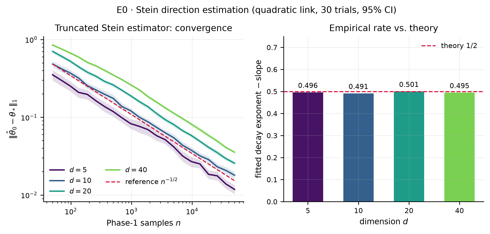
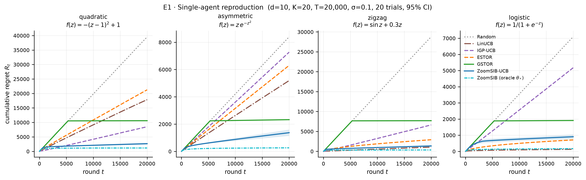
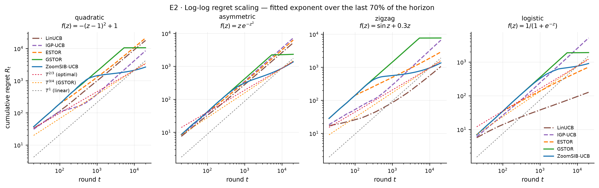
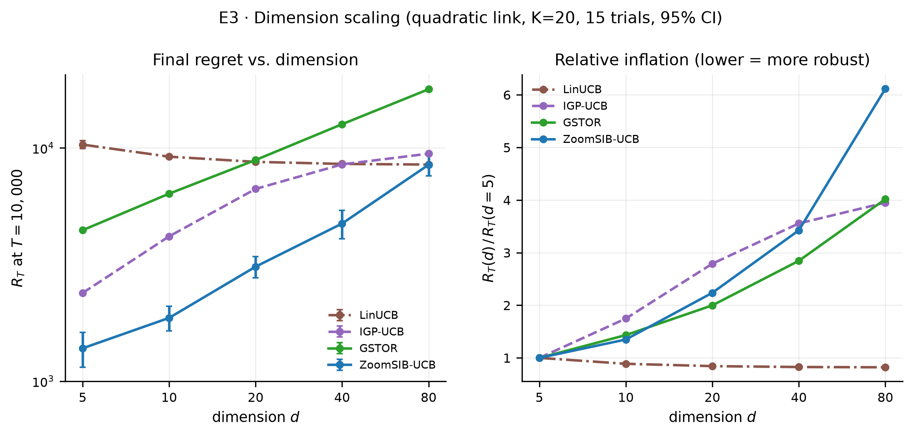
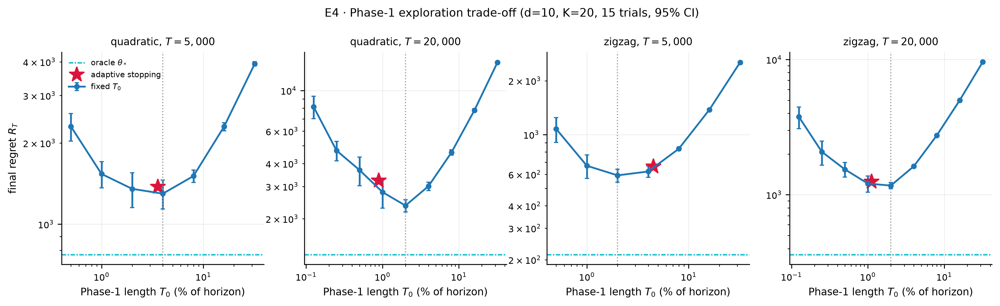

# Phase 1 Results — Single-Agent Baseline

**What this is:** the reproduction layer. Every algorithm here already exists; the point is
to have a *trustworthy measuring stick* before claiming anything about collaboration.

Reproduce with:
```bash
python experiments/exp01_stein_rate.py
python experiments/exp02_regret_curves.py
python experiments/exp03_loglog_slope.py
python experiments/exp04_dim_scaling.py
python experiments/exp05_explore_tradeoff.py
```

---

## 0. Two setup decisions that change what the benchmark measures

### 0.1 The score function is assumed known

Stein's identity needs `S(x) = −∇log p(x)`. The whole single-index-bandit literature
assumes it, and so do we; contexts are Gaussian, so `S` is closed-form. State it openly —
it is the most likely question from an audience.

### 0.2 Contexts are scaled so the projected index has unit variance

This one is not cosmetic, and it is worth a slide.

Identifiability forces `‖θ*‖₁ = 1`. With plain standard-Gaussian contexts the projected
index `⟨x,θ*⟩` then has standard deviation `‖θ*‖₂`, which is `≈ 0.36` at `d = 10` and
shrinks like `1/√d`. The "non-monotone" links are only non-monotone on a range the index
never reaches. Measured directly — how often does the best arm differ from the
highest-projection arm, over 4000 rounds with `K = 20`:

| link | plain Gaussian contexts (`‖θ*‖₂ ≈ 0.36`) | unit-variance index |
|---|---:|---:|
| quadratic `−(z−1)²+1` | **0.5 %** | **94.0 %** |
| asymmetric `z e^{−z²}` | 19.1 % | 99.0 % |
| zigzag `sin z + 0.3z` | **0.0 %** | 26.7 % |
| logistic (monotone control) | 0.0 % | 0.0 % |

With plain contexts, quadratic and zigzag are **effectively monotone on their support** —
a benchmark that claims to test non-monotone links but does not. We therefore scale the
context distribution so `Var(⟨x,θ*⟩) = 1` (`index_scale=1.0`). This keeps the ℓ1
normalisation the theory requires, puts the link's non-monotonicity inside the support, and
holds difficulty fixed across `d`, which the dimension sweep needs. The logistic control
correctly stays at 0 % in both columns.

**Default configuration:** `d = 10`, `K = 20`, `σ = 0.1`, `δ = 0.01`, 20 trials,
`T = 20 000`, with both the problem instance `θ*` and the noise re-drawn per trial.

---

## 1. E0 — The Stein estimator converges at exactly `n^{-1/2}`



Fitted log-log slopes of `‖θ̂₀ − θ*‖₁` against `n`, 30 trials:

| `d` | 5 | 10 | 20 | 40 |
|---|---:|---:|---:|---:|
| fitted exponent | **−0.496** | **−0.491** | **−0.501** | **−0.495** |
| error at `n ≈ 1000` | 0.083 | 0.121 | 0.189 | 0.262 |

Theory says `−1/2`. This is the most important number in Phase 1, for two reasons: nothing
downstream can work if it fails, and **it is the quantity the federated extension
improves** — with `N` agents the effective sample size becomes `N·n`, so the claim
"`N` agents reach the same accuracy from `n/N` samples each" is only measurable against a
verified single-agent rate. The error also grows roughly like `√d`, which is why we expect
collaboration to pay off most in high dimension.

---

## 2. E1 — Main comparison



Final cumulative regret `R_T` at `T = 20 000`, mean ± 95 % CI half-width, 20 trials:

| algorithm | quadratic | asymmetric | zigzag | logistic *(monotone)* |
|---|---:|---:|---:|---:|
| Random | 39534 ± 132 | 8400 ± 19 | 28793 ± 45 | 7097 ± 9 |
| LinUCB | 17865 ± 183 | 5190 ± 12 | 1063 ± 29 | **127 ± 19** |
| IGP-UCB | 8510 ± 47 | 7274 ± 14 | 6642 ± 28 | 5175 ± 10 |
| ESTOR | 21267 ± 77 | 6304 ± 26 | 2918 ± 22 | 708 ± 38 |
| GSTOR | 10593 ± 73 | 2325 ± 17 | 7701 ± 22 | 1910 ± 6 |
| **ZoomSIB-UCB** | **2657 ± 323** | **1371 ± 234** | **1358 ± 235** | 906 ± 142 |
| *ZoomSIB (oracle `θ*`)* | *1166 ± 95* | *260 ± 7* | *349 ± 11* | *169 ± 3* |

**ZoomSIB-UCB is the best deployable algorithm on all three non-monotone links**, by
4.0× over GSTOR on quadratic, 1.7× on asymmetric and 5.7× on zigzag.

Reading the rest of the table is what makes it a reproduction rather than a plot:

- **ESTOR behaves exactly as its assumption predicts.** It assumes `f` is increasing, so it
  plays `argmax⟨x,θ̂⟩`. On quadratic that rule is simply wrong and it lands at 21267 —
  *worse than LinUCB*. On the monotone logistic link it drops to 708. This is the
  monotone-vs-non-monotone distinction made visible.
- **LinUCB is misspecified by construction** and is near-linear on the non-monotone links
  (§3), which is the empirical face of Ghosh, Chowdhury & Gopalan (2017): misspecification
  does not degrade gracefully.
- **GSTOR shows the explore-then-commit signature** — a linear ramp for its `O(T^{3/4})`
  exploration prefix (5318 rounds here, 27 % of the horizon), then a perfectly flat tail.
  Its total regret is dominated by that fixed prefix. This is precisely the weakness Dey
  et al. cite, and ZoomSIB-UCB's adaptive stopping is the fix.
- **The oracle-`θ*` ablation shows where the remaining regret lives.** Handing ZoomSIB the
  true direction cuts regret by 2.3× (quadratic) to 5.3× (asymmetric). So at these
  horizons **most of ZoomSIB-UCB's regret is the cost of estimating the direction** — which
  is exactly the component that one-shot Stein averaging is meant to amortise across agents.

### Adaptive stopping reproduces the paper's reported behaviour

Dey et al. report that their adaptive rule exits at ~1.8 % of the horizon for easy
functions and waits longer on flatter geometries. Ours, given neither `T₀` nor `μ*`:

| link | `T₀` | % of horizon | `μ*` (signal strength) |
|---|---:|---:|---:|
| zigzag | 197 | 0.99 % | 1.24 |
| quadratic | 335 | **1.67 %** | 2.00 |
| asymmetric | 456 | 2.28 % | 0.71 |
| logistic | 1388 | 6.94 % | 0.24 |

The ordering tracks `μ*` — the flatter the link, the weaker the Stein signal, the longer
the rule waits. The 1.67 % on quadratic matches the paper's ~1.8 % closely.

---

## 3. E2 — Log-log scaling



Fitted exponent `α` in `R_T ~ T^α`, over the last 70 % of the horizon:

| algorithm | quadratic | asymmetric | zigzag | logistic |
|---|---:|---:|---:|---:|
| LinUCB | 0.967 | 0.980 | 0.921 | 0.412 |
| IGP-UCB | 1.031 | 1.011 | 1.041 | 1.017 |
| ESTOR | 0.970 | 0.997 | 0.623 | 0.514 |
| GSTOR | 0.005 | 0.031 | 0.004 | 0.010 |
| **ZoomSIB-UCB** | **0.294** | **0.602** | **0.455** | **0.227** |

Three things to read carefully:

**ZoomSIB-UCB is below the `2/3` worst-case ceiling everywhere**, consistent with Dey et
al.'s own empirical slope of 0.53 — the minimax bound is tight only on adversarial
instances. More interestingly, the *ordering across links* tracks theory. Corollary 4.8 of
the paper predicts `O(T^{1/3} log T)` — slope `≈ 0.33` — when `f` has a **unique
well-separated maximum**. Quadratic has exactly that, and measures **0.294**. Asymmetric,
whose peak is flatter and whose shape gives the least separation, measures **0.602**, close
to the `2/3` worst case. Zigzag, with multiple local maxima, sits between at 0.455. The
instance-dependent bound is visible in the data.

**LinUCB's `≈0.97` is linear regret** — the misspecification result, reproduced.

**GSTOR's `≈0` is an artefact of explore-then-commit, not a win.** Its tail is flat because
it has already committed; all of its regret was paid upfront. Slope is the wrong summary
statistic for an ETC algorithm — compare total regret (§2) instead. We report it only to
make the point explicit.

**IGP-UCB is near-linear at this horizon.** Expected: GP-UCB's regret scales with the
maximum information gain `γ_T`, which for an RBF kernel in `d = 10` grows like
`(log T)^{d+1}` — the curse of dimensionality that the single-index structure exists to
avoid. Our subset-of-data approximation (250 inducing points) likely contributes too, so we
do not lean on this number beyond the qualitative point.

---

## 4. E3 — Dimension scaling



Final regret at `T = 10 000` on the quadratic link, 15 trials:

| algorithm | `d=5` | `d=10` | `d=20` | `d=40` | `d=80` | inflation 5→80 |
|---|---:|---:|---:|---:|---:|---:|
| LinUCB | 10320 | 9162 | 8704 | 8529 | 8476 | 0.82× |
| IGP-UCB | 2388 | 4175 | 6665 | 8493 | 9436 | 3.95× |
| GSTOR | 4436 | 6360 | 8867 | 12623 | 17822 | 4.02× |
| **ZoomSIB-UCB** | **1383** | **1867** | **3095** | **4738** | **8461** | 6.12× |

**ZoomSIB-UCB has the lowest regret at every dimension.** Its *relative* inflation is the
largest, but that ratio is misleading in two ways and both are worth stating:

- It is unflattering precisely *because* its `d=5` baseline is so good — 1383 against
  GSTOR's 4436. In absolute terms it never loses.
- LinUCB's `0.82×` is not robustness. LinUCB is misspecified and already near the
  maximum regret the problem allows, so it has nowhere left to go; its curve is flat
  because it is uniformly bad, not because it handles dimension well.

**We do not reproduce Dey et al.'s small `2.3×` inflation, and the reason is
methodological.** Their Fig. 1d uses plain standard-Gaussian contexts with `‖θ*‖₁ = 1`, so
the index range `‖θ*‖₂` *shrinks* as `1/√d` — the link flattens over the realised support
and the problem gets intrinsically easier with `d`, partly cancelling the estimation cost.
Our unit-variance-index normalisation (§0.2) removes that confound and isolates the true
cost of estimating a `d`-dimensional direction. The honest statement is that ZoomSIB-UCB
remains the best method at every `d`, but the direction-estimation cost is real and grows.

**The mechanism is visible in the Phase-1 length**, which the adaptive rule chooses without
being told `d`:

| `d` | 5 | 10 | 20 | 40 | 80 |
|---|---:|---:|---:|---:|---:|
| `T₀` chosen | 110 | 282 | 930 | 1663 | 3612 |
| % of a 10 000-round horizon | 1.1 % | 2.8 % | 9.3 % | 16.6 % | **36.1 %** |

At `d = 80` the algorithm spends **36 % of the whole horizon** just estimating `θ*`. That
single number is the strongest motivation in Phase 1 for the federated extension: this is
precisely the cost that one-shot Stein averaging should cut by a factor `N`, at a
communication cost of one message of `d` numbers.

(The rule's `T₀` grows roughly like `d^{1.26}`, slower than the `d²` the theory prescribes
— so it under-explores in high dimension, which is part of why the `d=80` regret is as
large as it is. Worth revisiting when we federate.)

---

## 5. E4 — The Phase-1 exploration trade-off



Sweeping a *fixed* `T₀` and measuring final regret exposes what the adaptive rule is trying
to find. The curves are cleanly U-shaped: too little exploration gives a bad direction and
the binned UCB then optimises the wrong scalar; too much pays uniform-random regret for no
extra benefit.

| link | `T` | best `T₀` | % of `T` | `R_T` at best | adaptive `T₀` | % of `T` | `R_T` adaptive | oracle `θ*` |
|---|---:|---:|---:|---:|---:|---:|---:|---:|
| quadratic | 5 000 | 200 | 4.00 % | 1298 | 179 | 3.58 % | 1375 | 770 |
| quadratic | 20 000 | 400 | **2.00 %** | 2358 | 179 | 0.90 % | 3224 | 1272 |
| zigzag | 5 000 | 100 | **2.00 %** | 592 | 225 | 4.49 % | 663 | 213 |
| zigzag | 20 000 | 400 | **2.00 %** | 1169 | 225 | 1.12 % | 1251 | 360 |

**The optimum sits at ~2 % of the horizon** in three of four panels — independently
reproducing the ~1.8 % that Dey et al. report for the quadratic link. Getting this wrong is
expensive in one direction: at 32 % exploration, regret is roughly 4× the optimum, which is
exactly the failure mode of GSTOR's rigid `O(T^{3/4})` prefix.

**The adaptive rule works, with one honest caveat.** It lands within 6–12 % of the optimal
regret in three panels. But its chosen `T₀` is **horizon-independent** — 179 for quadratic
at both `T = 5 000` and `T = 20 000`, 225 for zigzag at both — because a drift-based
stability test has no knowledge of `T`. The optimal `T₀` *does* grow with `T` (200 → 400),
so the rule under-explores at long horizons: on quadratic at `T = 20 000` it costs
**37 % excess regret** (3224 vs 2358).

**The rule is also high-variance.** Across seeds in E1 the chosen `T₀` ranged over
`[75, 383]` for quadratic, and the mean differs between E1 (335, 20 trials) and E4 (179,
15 trials) purely through the exploration RNG. Reported means should be read with that
spread in mind.

Both limitations are concrete, cheap improvements for Phase 2 — make the stopping test
horizon-aware (the theory prescribes `T₀ ∝ d²T^{2/3}`, so the target accuracy should
tighten with `T`), and average the stability statistic over more checkpoints to cut the
variance. **Federation helps here too:** with `N` agents the same accuracy is reachable
from `T₀/N` rounds each, which moves the whole U-curve left and makes the penalty for
mis-setting `T₀` proportionally smaller.

---

## 6. What Phase 1 establishes for the federated stage

1. **The `n^{-1/2}` Stein rate is verified**, so "`N` agents, `n/N` samples each" is a
   measurable claim with a trusted reference curve.
2. **Direction estimation, not binned exploration, dominates the regret** at these
   horizons — the oracle-`θ*` ablation shows a 2.3–5.3× gap. Federation targets exactly
   that component.
3. **The `d`-dependence is concentrated in Phase 1**, and it is severe: at `d = 80` the
   algorithm spends 36 % of the horizon estimating `θ*`. "Collaboration helps most in high
   dimension" now has a measured mechanism behind it, not just an argument.
4. **Adaptive stopping works** and removes the biggest practical obstacle (the theoretical
   `T₀` exceeds every simulable horizon) — but it is horizon-independent and high-variance,
   costing up to 37 % excess regret at long horizons. Two cheap fixes are identified.
5. **The right target accuracy is known.** E4 gives the `T₀`-vs-regret curve for a single
   agent; the federated claim is that the same curve is reachable with `T₀/N` rounds per
   agent. That is a direct, falsifiable comparison against an existing measurement rather
   than a fresh assertion.

---

## Implementation notes

Two optimisations were needed to make the sweeps affordable. Both are documented in the
code and neither changes an algorithm's decisions:

- **GSTOR link tabulation.** GSTOR is explore-then-commit, so its Nadaraya-Watson link
  estimate never changes after the prefix. Evaluating it exactly every round costs
  `O(K·T^{3/4})` per round and dominated the entire budget. We tabulate it once on a
  4096-point grid and interpolate. Verified equivalent: max deviation `8.5e-06` inside the
  grid (grid step is 1 % of the kernel bandwidth), and *identical* final regret. The only
  deviations were at 17 of 20 000 query points falling outside the training support, where
  exact NW divides by a vanishing denominator — clamping is the better-behaved choice.
  Cost: 52 s → 0.7 s per trial.
- **IGP-UCB.** Invert the kernel matrix once per refit so the per-round posterior variance
  is a matmul rather than an `O(n³)` solve, and preallocate the observation buffer. Cost:
  243 s → 36 s per trial at `T = 20 000`.

`ESTOR` and `GSTOR` are our reimplementations — no reference code is public — following the
templates in Kang et al. with the exploration rates their analysis prescribes (`O(√T)` and
`O(T^{3/4})`) and constants exposed as arguments. They are faithful in spirit, not
bit-exact.
